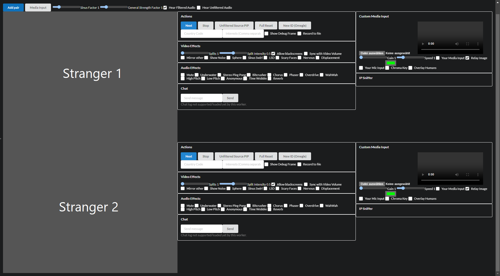

# Omegle MITM (Man In The Middle/Interceptor)

This is a userscript aiming to be a very feature-rich and flexible man-in-the-middle for stranger video chat sites with many effects, features striving for maximizing the user experience. 

## Features

This is currently aiming to support *Omegle* and *Ome.Tv* (see below for more information).

- OBS or virtual cameras not required for anything
- Connect 2+ strangers with each other and watch their videos, audio and chat in an own **user interface**
- **IP sniffer** and geolocator
- Automatic **IP changer** for others using an IP sniffer
- Seamless fake loading animations 
- Custom **chat interface and controls**
- **Record** the strangers to a video file (VP9, Opus)
- **Ban prevention** and NSFW filter bypass
- **Video manipulation**
  - Automatically relay the video of the stranger
  - Replace with video files
  - Overlay video files (opacity green-screen)
  - Mix video files or other stranger with split-screen functionality
  - Overlay stranger with person segmentation (TensorflowJS AI model)
  - Add own camera or screen-share media input (e. g. YouTube tab, Snap camera)
  - Ability to change speed, opacity and volume of videos
  - Picture-in-Picture mode
  - Effects
    - Show Fake Skip Loading Animation
    - Show The Stranger Themselves
    - Bulge
    - Swirl
    - Color LSD
    - Scary Face Effect
    - Nervous Frames
    - Luminosity Displacement
    - and more...
- **Audio manipulation**
    - Automatically relay the audio of the stranger 
    - Add own microphone or screen-share media input
    - Add audio of videos (without relaying the image)
    - Effects
      - Mute
      - Underwater
      - Bit-Crushing
      - Stereo Ping Pong
      - Chorus
      - Phaser
      - Overdrive
      - WahWah
      - Low/High Pitch
      - Monster Effect
      - Pitch Oscillator
      - Reverb
- Custom rendering and audio pipelines
- Ability to intercept more than just 2 strangers in one window
- Very high reliability and robustness
- Secure inter-frame communication with the target site

## Installation and Usage

Install the userscript from the releases with **TamperMonkey**. This is required for it to work as expected.

It is **required** to go into the TamperMonkey settings, enable expert mode and under *inject mode*, this needs to be changed to *Instant*.

Because Omegle uses a special way to load their scripts, it is required to keep open the devtools in the Network tab with *Disable cache* enabled until you clicked on start and have waited for 5 seconds. Then they can be closed.

Then, open the target website under the path `/robots.txt`. The user interface will appear. (Reloads might be required after first use)

## Code Architecture

This is a userscript that can be compiled with webpack.

The architecture can be divided into **workers and controllers**. The controller is executed in the main frame on the target site and displays the entire user interface and interoperates with the workers in the iframes.
The worker is executed on the actual target site and hooks, intercepts and replaces the media input and performs user actions programmatically.
It is recommended to take a look into `consts.ts`.

## Current Situation

Omegle has fully shut down. The userscript barely works on Ome.Tv at the moment. More sites are not yet supported.

## On Trademarks and Copyright

This repository is released into the public domain according to the GPL 3.0 license by the copyright holders.

Disclaimer: This repository and the used names "Omegle", "Ome.Tv" in this project are not affiliated with or endorsed by any third parties. This repository and the used names are also not affiliated with any existing trademarks.

No code was copied or used from any of the mentioned sites in this repository.

This repository does not infringe any copyright of proprietary software, as it only adds features on the end user's computer, without having any copyright-protected code or text regarding the aforementioned entities included in this repository.

Create a GitHub issue if you would like to discuss being removed from this repository.
